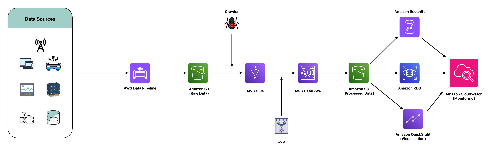

# Data Quality and Consistency Solution
Inconsistent and poor-quality data can lead to incorrect business insights and decisions. Organizations often struggle with maintaining data quality and consistency across different data sources, which can include on-premises databases, cloud storage, and various data formats. Ensuring data integrity and consistency across these sources is critical for reliable analytics and reporting.

## Sample Scenario - MadHatter Corp.

Inconsistent and poor-quality data can lead to incorrect business insights and decisions. `MadHatter Corp.`, a renowned provider of innovative consumer products, faces significant challenges in maintaining data quality and consistency across its diverse data sources. These sources include on-premises databases containing customer and transactional data, cloud storage holding various data formats, and data from external APIs and IoT devices embedded in their products.

The lack of standardized data quality and consistency across these disparate sources has led to unreliable analytics and reporting. Decision-makers at `MadHatter Corp.` have found it increasingly difficult to trust the insights generated from their data, resulting in missed opportunities and suboptimal business strategies.

To address these challenges, `MadHatter Corp.` developed a comprehensive solution to ensure data quality and consistency. This solution leverages AWS Glue for data cataloging and ETL tasks, AWS DataBrew for visual data preparation, and Amazon Redshift for high-quality data storage and analysis. Additionally, Amazon RDS is used to maintain the integrity of relational databases.

By implementing this architecture, MadHatter Corp. has significantly improved the quality and consistency of its data. The solution ensures that all data sources are cleaned, normalized, and integrated, providing a solid foundation for analytics and reporting. This enables MadHatter Corp. to generate accurate business insights, make data-driven decisions, and maintain a competitive edge in the market.

## AWS Tools Used - DeepDive

### AWS Glue

`AWS Glue` is a fully managed extract, transform, and load (ETL) service that makes it easy to prepare and load data for analytics. It automates much of the effort involved in data preparation, allowing users to discover, transform, and catalog data efficiently.

    

#### Key Features:

- Data Cataloging: `AWS Glue` automatically discovers and catalogs metadata about your data sources into a unified data catalog. This makes data assets easily searchable and accessible.
- ETL Automation: Provides a serverless environment to run ETL jobs with auto-scaling capabilities, which simplifies the process of extracting, transforming, and loading data.
- Developer-Friendly: Supports both visual and code-based interfaces for building ETL workflows using Glue Studio and Glue API/SDKs.
- Integrated Data Processing: Seamlessly integrates with Amazon S3, Redshift, RDS, and other data sources, making it a versatile tool for data preparation.

#### Use in Project:
In our data quality and consistency solution, `AWS Glue` is used for its powerful ETL capabilities. `Glue crawlers` are employed to automatically discover data schemas in our S3 buckets and other data sources, and `Glue jobs` perform the necessary transformations to clean and normalize the data before it is loaded into Amazon Redshift for analysis.

### AWS DataBrew

`AWS Glue DataBrew` is a visual data preparation tool that makes it easy for data analysts and data scientists to clean and normalize data without writing code. It offers an intuitive interface to visually transform data, making it more accessible for users with varying technical skills.

    

#### Key Features:

- Visual Interface: Provides a user-friendly, no-code interface for data preparation tasks, allowing users to visually explore, clean, and normalize data.
- Data Profiling: Automatically profiles data to provide insights into its quality and structure, helping users identify and address data quality issues.
- Automated Recipes: Allows users to create and apply reusable recipes for data transformations, ensuring consistency in data preparation.
- Integration: Works seamlessly with AWS Glue, Amazon S3, and Amazon Redshift, enabling a smooth data preparation workflow.

#### Use in Project:
`AWS DataBrew` is used for visual data preparation. Data analysts at MadHatter Corp. use DataBrew to visually clean and prepare data, applying transformations to ensure data quality and consistency. DataBrew recipes automate these data preparation tasks, ensuring that the same cleaning rules are consistently applied to all datasets.

### Amazon Redshift

`Amazon Redshift` is a fast, fully managed data warehouse that makes it simple and cost-effective to analyze large volumes of data using SQL. It enables running complex queries and performing sophisticated analytics on big data.

    

#### Key Features:

- High Performance: Delivers fast query performance through columnar storage, data compression, and parallel query execution.
- Scalability: Scales from a few hundred gigabytes to a petabyte or more of data, supporting growth in data volume and query complexity.
- Cost-Effective: Offers on-demand pricing and reserved instance pricing models, providing flexibility and cost savings.
- Integration: Integrates with a wide range of AWS services, including S3, Glue, Data Pipeline, and more.

#### Use in Project:
`Amazon Redshift` serves as the data warehousing solution where all cleaned and normalized data is stored. Its powerful analytics capabilities enable MadHatter Corp. to run complex queries and generate reliable insights, supporting informed decision-making based on high-quality, consistent data.

### Amazon RDS (Relational Database Service)

`Amazon RDS` is a managed relational database service that simplifies the setup, operation, and scaling of databases in the cloud. It supports multiple database engines, including MySQL, PostgreSQL, and Oracle, and provides high availability and automated management features.

    

#### Key Features:

- Automated Administration: Handles routine database tasks such as provisioning, patching, backup, and recovery.
Scalability: Easily scales compute and storage resources with a few clicks or API calls, accommodating growth in data volume and performance needs.
- High Availability: Offers Multi-AZ deployments for enhanced availability and durability, ensuring continuous database operation.
- Security: Provides data encryption at rest and in transit, VPC isolation, and IAM integration for secure access control.

#### Use in Project:
`Amazon RDS` is used to manage relational databases, ensuring the integrity and consistency of transactional data. Its robust management features and high availability support the reliable operation of MadHatter Corp.'s critical databases, ensuring that data remains accurate and accessible for analysis.

## References
- [AWS Glue Documentation](https://docs.aws.amazon.com/glue/)
- [AWS Glue DataBrew Documentation](https://docs.aws.amazon.com/databrew/latest/dg/)
- [Amazon Redshift Documentation](https://docs.aws.amazon.com/redshift/)
- [Amazon RDS Documentation](https://docs.aws.amazon.com/rds/)
