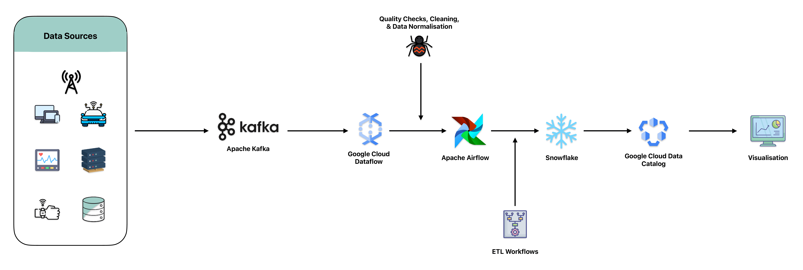

### Enhancing Data Quality and Consistency Using GCP, Kafka, Airflow, and Snowflake

#### Problem Statement
Inconsistent and poor-quality data can lead to incorrect business insights and decisions. Organizations like `MadHatter Corp.`, a renowned provider of innovative consumer products, often struggle with maintaining data quality and consistency across diverse data sources. These sources include on-premises databases containing customer and transactional data, cloud storage with various data formats, data from external APIs, and IoT devices embedded in their products.

The lack of standardized data quality and consistency across these disparate sources has resulted in unreliable analytics and reporting. Decision-makers at `MadHatter Corp.` have found it increasingly difficult to trust the insights generated from their data, leading to missed opportunities and suboptimal business strategies.

To address these challenges, `MadHatter Corp.` implemented a comprehensive data quality management solution utilizing Google Cloud Platform (GCP) services, Apache Kafka, Apache Airflow, and Snowflake. This solution was designed to clean, normalize, and integrate data from various sources to ensure high-quality data, enabling the company to generate reliable analytics and make informed business decisions.

#### GCP and Open-Source Tools Used - DeepDive

##### Google Cloud Dataflow
Google Cloud Dataflow is a fully managed service for real-time and batch data processing. It enables the execution of large-scale data processing tasks, applying transformations to ensure data quality and consistency. Dataflow supports both stream and batch processing, making it ideal for integrating, cleaning, and normalizing diverse data sources.

**Key Features:**
- **Real-time Processing:** Supports stream processing for real-time data ingestion and transformations, ensuring that data is cleaned and normalized as it arrives.
- **Flexibility:** Supports both batch and stream processing, making it versatile for different data pipeline needs.
- **Scalability:** Automatically scales to handle large volumes of data without manual intervention, ensuring that processing capacity matches the data load.
- **Integration:** Integrates seamlessly with other GCP services like Cloud Storage, BigQuery, and Pub/Sub, enabling a smooth end-to-end data processing workflow.

**Use in Project:**
In our data quality and consistency solution, Google Cloud Dataflow is used for real-time data processing and transformation. Dataflow applies cleaning and normalization rules to incoming data streams from Kafka, ensuring consistency across all data sources before it is loaded into Snowflake for analysis.

##### Apache Kafka
Apache Kafka is a distributed streaming platform that excels in handling real-time data pipelines and streaming applications. Kafka's ability to ingest data from various sources, including IoT devices and external APIs, makes it an essential component in ensuring data quality at the point of entry.

**Key Features:**
- **High Throughput:** Kafka handles large volumes of data with low latency, making it ideal for real-time data ingestion.
- **Fault Tolerance:** Ensures that data is consistently available even in the event of system failures, providing a reliable streaming platform.
- **Scalability:** Scales horizontally by adding more brokers, which helps accommodate increasing data loads without compromising performance.
- **Stream Processing:** Supports stream processing applications via Kafka Streams or integrates with other stream processing systems like Apache Flink or Google Dataflow.

**Use in Project:**
Apache Kafka is used as the primary streaming platform to ingest data from IoT devices and external APIs. Kafka ensures that real-time data is captured and quality checks are performed at the point of entry. This streaming data is then passed on to Google Cloud Dataflow for further processing.

##### Apache Airflow
Apache Airflow is an open-source platform to programmatically author, schedule, and monitor workflows. It is used to orchestrate the complex ETL workflows required for maintaining data quality and consistency across diverse data sources.

**Key Features:**
- **Workflow Orchestration:** Provides a rich set of features for managing dependencies and scheduling ETL workflows, ensuring that data pipelines run reliably and on time.
- **Scalability:** Can be scaled horizontally to handle large and complex workflows across different environments.
- **Extensibility:** Supports custom plugins and integrations with various services, making it adaptable to specific project requirements.
- **Monitoring:** Offers built-in tools for tracking the execution of workflows and handling errors, ensuring reliable pipeline execution.

**Use in Project:**
Apache Airflow is used to orchestrate complex ETL workflows, automating the process of extracting, transforming, and loading data into the unified system. Airflow manages the scheduling and execution of these workflows, ensuring that the data pipelines are consistent and reliable.

##### Snowflake
Snowflake is a cloud-based data warehouse solution that provides a secure and scalable environment for storing high-quality data. It offers robust data integrity checks, which are integrated into the ETL process to ensure that only clean and accurate data is stored.

**Key Features:**
- **Scalability:** Snowflake can automatically scale to accommodate growing data volumes, ensuring that it can handle large datasets efficiently.
- **Separation of Storage and Compute:** Allows independent scaling of compute and storage resources, providing cost-efficient performance.
- **Security:** Offers enterprise-grade security features, including end-to-end encryption, role-based access controls, and multi-factor authentication.
- **Query Performance:** Optimized for fast query performance through features like automatic clustering, result caching, and columnar storage.

**Use in Project:**
Snowflake serves as the centralized data warehouse where all cleaned and normalized data is stored. Its high-performance analytics capabilities enable `MadHatter Corp.` to generate reliable insights from high-quality, consistent data, supporting data-driven decision-making.

##### Google Cloud Data Catalog
Google Cloud Data Catalog is a fully managed metadata management service that allows organizations to quickly discover, manage, and understand their data assets. It enables the implementation of data governance policies, ensuring that all data sources are properly cataloged and standardized.

**Key Features:**
- **Metadata Management:** Provides a centralized catalog for managing metadata across all data assets, making it easier to discover and understand data sources.
- **Data Governance:** Enables the implementation of governance policies, ensuring that data is managed and accessed securely and consistently.
- **Integration:** Integrates with other GCP services, such as BigQuery and Cloud Storage, to provide a unified view of data assets across the organization.
- **Search and Discovery:** Offers powerful search capabilities to quickly find data assets, reducing the time spent on data discovery.

**Use in Project:**
Google Cloud Data Catalog is used to manage metadata and enforce data governance policies. It ensures that all data sources are properly cataloged, making it easier to maintain consistency and quality across `MadHatter Corp.`'s diverse data sources.

#### Outcome
By deploying this architecture, `MadHatter Corp.` significantly improved the quality and consistency of its data, leading to more reliable analytics and reporting. The solution empowered decision-makers to trust the insights generated from their data, enabling them to capitalize on new opportunities and make strategic business decisions with confidence. The company now enjoys a competitive advantage thanks to its ability to generate accurate, data-driven insights.

#### References
- [Google Cloud Dataflow Documentation](https://cloud.google.com/dataflow/docs)
- [Apache Kafka Documentation](https://kafka.apache.org/documentation/)
- [Apache Airflow Documentation](https://airflow.apache.org/docs/)
- [Snowflake Documentation](https://docs.snowflake.com/)
- [Google Cloud Data Catalog Documentation](https://cloud.google.com/data-catalog/docs)
